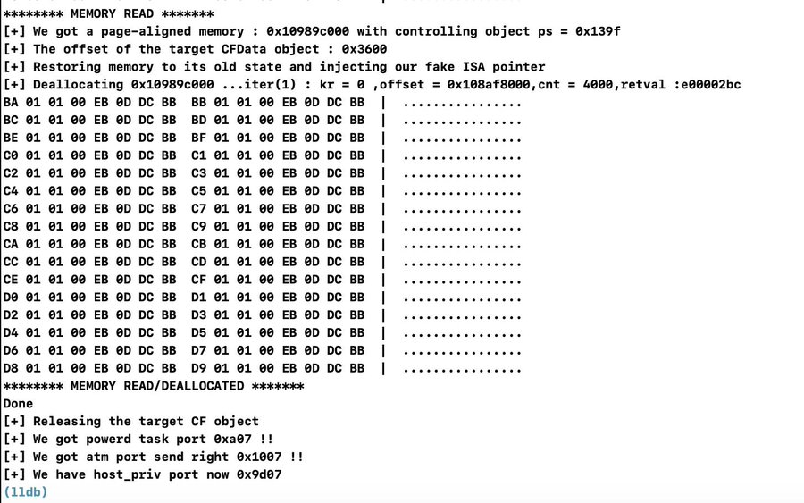

# powerd exploit : Sandbox escape to root for Apple iOS < 12.2 on A11 devices

## 저자 commnet

if you want to debug the exploit just uncomment MEMDBG/MEMDUMP,
if you want to debug the ROP chains enable LOCAL_EXP, 
and if someone wants to port it to another device or wants to chain 
it with a kernel bug to have a tfp0, I'll be glad to help

and of course the exploit can work on 
all iDevices including iOS10.x,11.x with some slight modifications.
